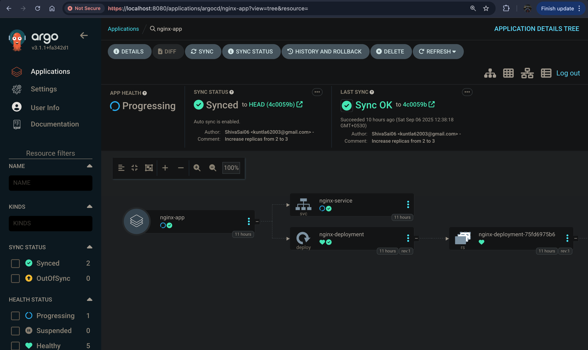
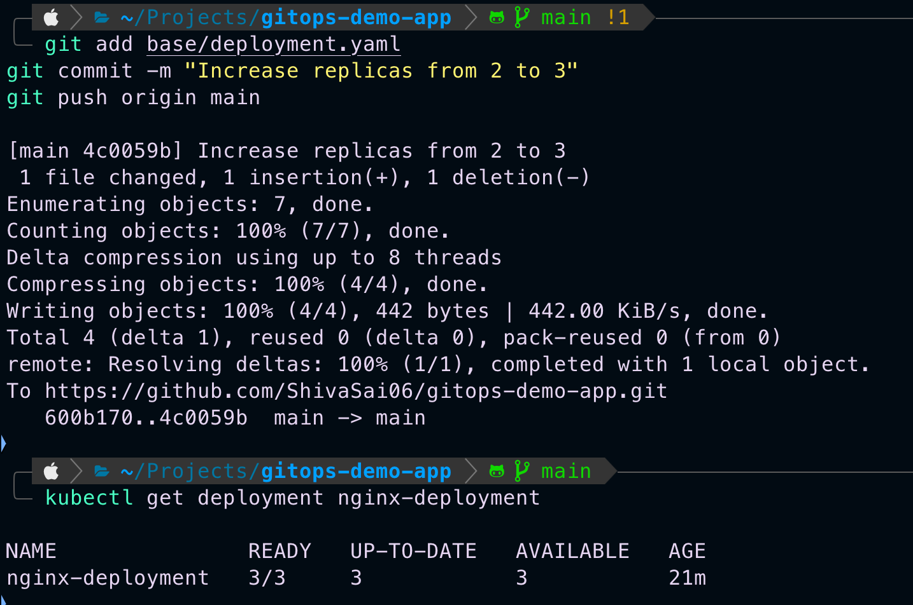
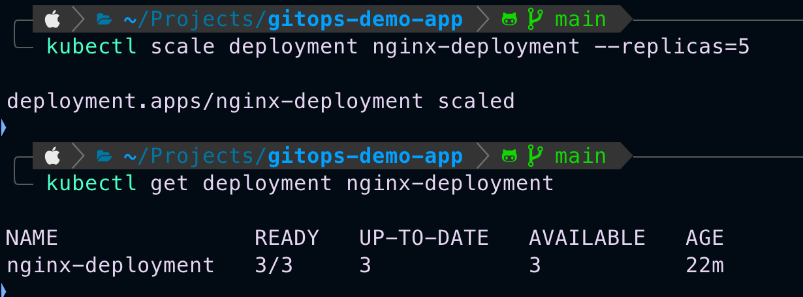
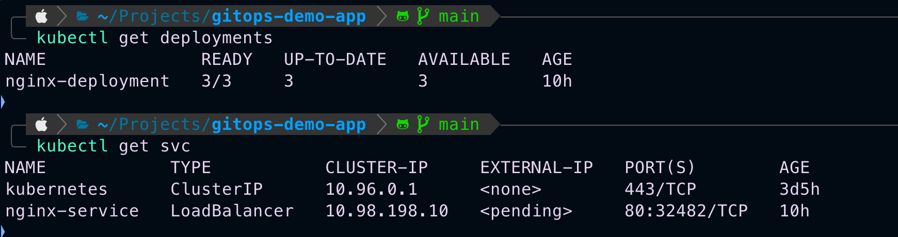
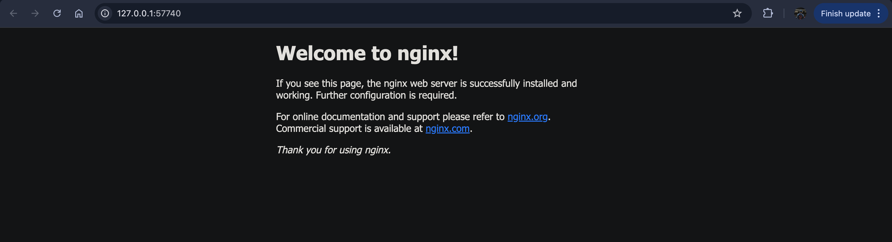

## ✅ Complete `README.md` – Including Installation & Configuration


# GitOps Demo App with Argo CD and Kubernetes

This project demonstrates how to implement **GitOps** using **Argo CD**, **Kubernetes (Minikube)**, and **GitHub**. The application is deployed and managed by syncing its state directly from a Git repository.

---

## 🚀 Objective

- Deploy an application to Kubernetes using Argo CD.
- Sync application state from Git automatically.
- Enable Auto-Sync, Auto-Prune, and Self-Heal to ensure the cluster stays aligned with Git.

---

## 📦 Tools Used

- **Minikube** – Local Kubernetes cluster.
- **Argo CD** – GitOps continuous delivery tool.
- **GitHub** – Source repository for application manifests.
- **kubectl / argocd CLI** – Command-line tools for interacting with the cluster and Argo CD.

---

## ✅ Prerequisites

- Docker installed on your machine.
- Minikube installed.
- kubectl installed.
- GitHub account for storing manifests.

---

## ⚙ Installation Steps

### ✅ 1. Start Minikube

```bash
minikube start --driver=docker
````

Check that it’s running:

```bash
kubectl cluster-info
```

---

### ✅ 2. Install Argo CD

```bash
kubectl create namespace argocd
kubectl apply -n argocd -f https://raw.githubusercontent.com/argoproj/argo-cd/stable/manifests/install.yaml
```

Verify the pods are running:

```bash
kubectl get pods -n argocd
```

---

### ✅ 3. Access Argo CD UI

1. Forward the port:

```bash
kubectl port-forward svc/argocd-server -n argocd 8080:443
```

2. Open your browser and go to:

```
https://localhost:8080
```

3. Retrieve the initial admin password:

```bash
kubectl -n argocd get secret argocd-initial-admin-secret -o jsonpath="{.data.password}" | base64 -d
```

Use this password to log in with username `admin`.

---

### ✅ 4. Install `argocd` CLI (Optional but recommended)

Download from the official Argo CD release:

```bash
# Example for Linux
curl -sSL -o argocd https://github.com/argoproj/argo-cd/releases/latest/download/argocd-linux-amd64
chmod +x argocd
sudo mv argocd /usr/local/bin/
```

Login via CLI:

```bash
argocd login localhost:8080 --username admin --password <your-password> --insecure
```

---

## ✅ Application Configuration

### ✅ 1. Prepare Nginx Manifests in GitHub

Create a GitHub repository containing these files:

* **deployment.yaml** – Defines an Nginx deployment.
* **service.yaml** – Exposes Nginx using LoadBalancer.
* **kustomization.yaml** – Bundles the deployment and service.

Example deployment (`deployment.yaml`):

```yaml
apiVersion: apps/v1
kind: Deployment
metadata:
  name: nginx-deployment
  labels:
    app: nginx
spec:
  replicas: 2
  selector:
    matchLabels:
      app: nginx
  template:
    metadata:
      labels:
        app: nginx
    spec:
      containers:
      - name: nginx
        image: nginx:1.21.6
        ports:
        - containerPort: 80
```

Example service (`service.yaml`):

```yaml
apiVersion: v1
kind: Service
metadata:
  name: nginx-service
spec:
  selector:
    app: nginx
  ports:
    - protocol: TCP
      port: 80
      targetPort: 80
  type: LoadBalancer
```

Example `kustomization.yaml`:

```yaml
apiVersion: kustomize.config.k8s.io/v1beta1
kind: Kustomization
resources:
  - deployment.yaml
  - service.yaml
```

Push these files to GitHub.

---

### ✅ 2. Create an Application in Argo CD

1. In the Argo CD UI, click **New App**.
2. Enter the following details:

| Field            | Value                                                            |
| ---------------- | ---------------------------------------------------------------- |
| Application Name | nginx-app                                                        |
| Project          | default                                                          |
| Repository URL   | your GitHub repo                                                 |
| Revision         | HEAD                                                             |
| Path             | base                                                             |
| Cluster          | [https://kubernetes.default.svc](https://kubernetes.default.svc) |
| Namespace        | default                                                          |
| Sync Policy      | Automated (enable Prune and Self-Heal)                           |

3. Click **Create**.

---

### ✅ 3. Sync the Application

1. In the dashboard, click on `nginx-app`.
2. Click **SYNC** → confirm → Sync Now.
3. The application will be applied to the cluster.

---

## 📖 How to Verify the GitOps Workflow

### ✅ Auto-Sync

Edit the `deployment.yaml` and increase replicas from 2 to 3. Push to GitHub and watch Argo CD automatically apply the changes.

```bash
kubectl get deployment nginx-deployment
```

---

### ✅ Auto-Prune

Delete `service.yaml` from the Git repository, push changes, and Argo CD will remove the service from the cluster.

```bash
kubectl get svc
```

---

### ✅ Self-Heal

Manually scale the deployment:

```bash
kubectl scale deployment nginx-deployment --replicas=5
kubectl get deployment nginx-deployment
```

After a few seconds, Argo CD will revert the deployment to the original state.

```bash
kubectl get deployment nginx-deployment
```

---

## 📸 Screenshots

### ✅ 1. Argo CD Dashboard

Shows the application synced and healthy.



---

### ✅ 2. Sync Process

Argo CD syncing after changes are pushed.



---

### ✅ 3. Self-Heal in Action

Argo CD reverting manual changes.



---

### ✅ 4. Final Working State

Deployment and service running successfully.



---

### ✅ 5. Application Webpage

Nginx default webpage confirming the service is accessible.



---

## 📂 Deliverables

* GitHub repository containing manifests.
* Argo CD screenshots showing the application’s status and features.
* Documentation explaining the setup, workflow, and verification steps.

---

## 📌 Final Notes

* The cluster state is fully managed from Git using Argo CD.
* Auto-Sync, Auto-Prune, and Self-Heal ensure consistency and reliability.
* This setup can be extended for production environments or multi-stage deployments.

Feel free to explore, experiment, and expand this setup!


